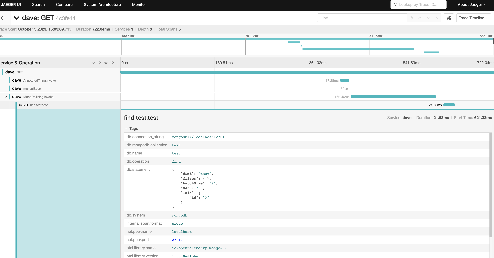

# Auto Instrumentation with OTEL Agent and micronaut

## Description

* This example shows how you can run the MN app with the OTEL agent. (see the run task in the build.gradle.kts file)
* It also shows how you can pull in the OTEL tracer into your code to create your own spans.
* It also shows how you can use the OTEL annotations to create spans.

## Running the example against jaeger (locally)

1. start jaeger locally

```bash
docker run --name jaeger3 -e COLLECTOR_OTLP_ENABLED=true -p 16686:16686 -p 4317:4317 -p 4318:4318 jaegertracing/all-in-one:1.35
```

2. open the jaeger ui at http://localhost:16686/
3. start the app

```bash
./gradlew run
```

4. call the app

```bash
curl -X GET http://localhost:8080/hello
```

5. look in the jaeger ui for the traces



## Running the example against new relic (hosted)

1. start the app

```bash
export OTEL_KEY=your_new_relic_key_here
export OTEL_ENDPOINT=https://otlp.nr-data.net:4317
./gradlew run
```

4. call the app

```bash
curl -X GET http://localhost:8080/hello
```

5. look in the new relic and find your trace by the traceId returned in the header