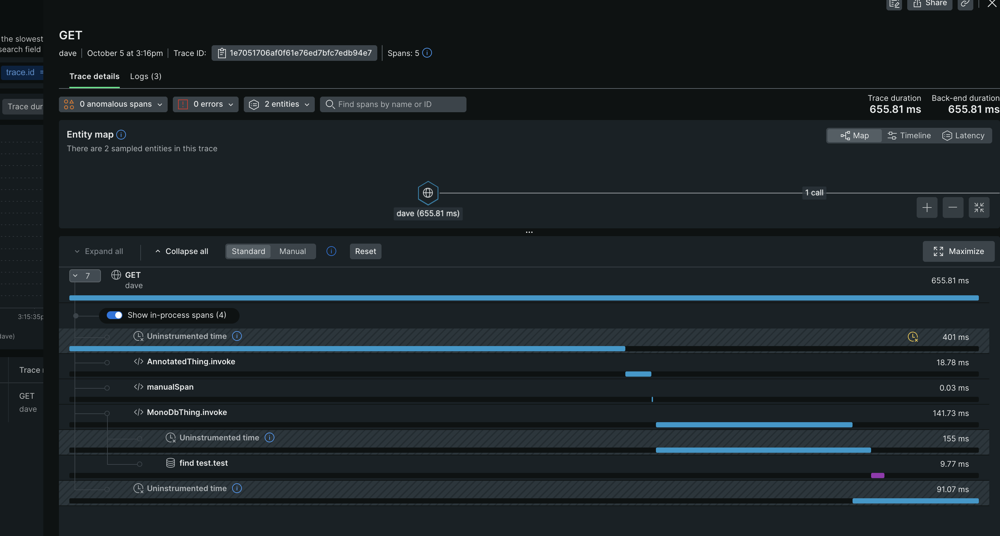

# Auto Instrumentation with OTEL Agent and micronaut

## Description

* This example shows how you can run the MN app with the OTEL agent. (see the run task in the build.gradle.kts file)
* It also shows how you can pull in the OTEL tracer into your code to create your own spans.
* It also shows how you can use the OTEL annotations to create spans.

## starting mongo locally

```bash
docker run -p 27017:27017 mongo
```

## Running the example against jaeger (locally)

1. start jaeger locally

```bash
docker run --name jaeger3 -e COLLECTOR_OTLP_ENABLED=true -p 16686:16686 -p 4317:4317 -p 4318:4318 jaegertracing/all-in-one:1.35
```

2. open the jaeger ui at http://localhost:16686/
3. start the app

```bash
./gradlew run
```

4. call the app

```bash
curl -X GET http://localhost:8080/hello
```

5. look in the jaeger ui for the traces


## Running the example against new relic (hosted)

1. start the app

```bash
export OTEL_EXPORTER_OTLP_HEADERS=api-key=your_new_relic_key_here;

./gradlew clean shadowJar downloadOpenTelemetryAgent
export OTEL_SERVICE_NAME=dave;
export OTEL_EXPORTER_OTLP_ENDPOINT=https://otlp.nr-data.net:4317;
export OTEL_LOGS_EXPORTER=otlp;
export OTEL_EXPORTER_OTLP_COMPRESSION=gzip;
java -javaagent:./build/otel/opentelemetry-javaagent-all.jar -jar ./build/libs/micronaut-with-otel-agent-0.1-all.jar
```

4. call the app

```bash
curl -X GET http://localhost:8080/hello
```

5. look in the new relic and find your trace by the traceId returned in the header



## Running the example against new DynaTrace (hosted)

1. start the app

```bash
export "OTEL_EXPORTER_OTLP_HEADERS=Authorization=Api-Token your-dynatrace-api-token-here";
export OTEL_EXPORTER_OTLP_ENDPOINT=https://your-insance-no.live.dynatrace.com;

./gradlew clean shadowJar downloadOpenTelemetryAgent
export OTEL_SERVICE_NAME=dave;
export OTEL_LOGS_EXPORTER=otlp;
export OTEL_EXPORTER_OTLP_COMPRESSION=gzip;
export OTEL_EXPORTER_OTLP_PROTOCOL=http/protobuf
java -javaagent:./build/otel/opentelemetry-javaagent-all.jar -jar ./build/libs/micronaut-with-otel-agent-0.1-all.jar
```

4. call the app

```bash
curl -X GET http://localhost:8080/hello
```

5. look in the dynaTrace and find your trace by the traceId returned in the header

